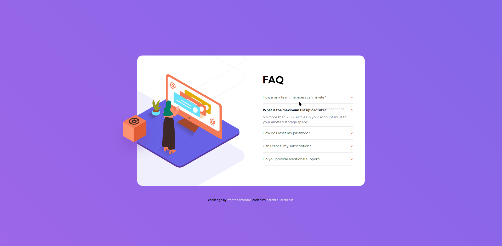
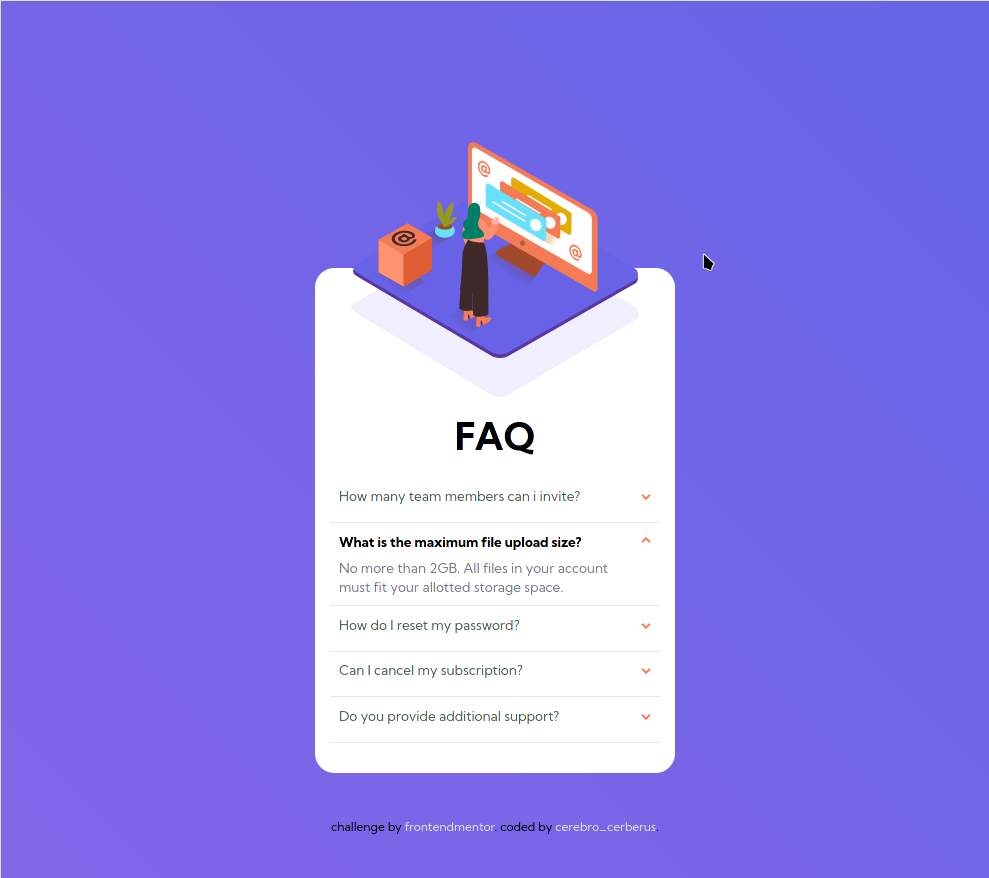
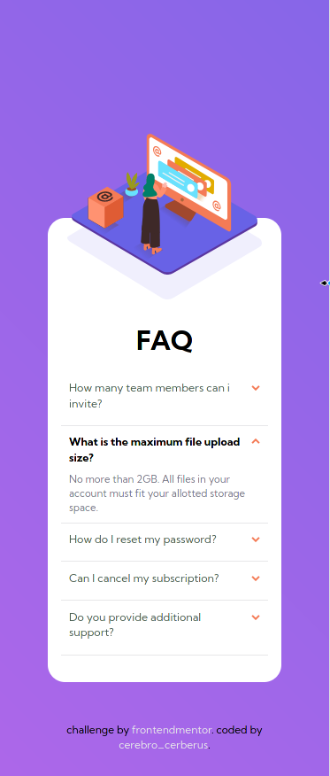

  - [About Project](#about-project)
  - [Screen Shots](#screen-shots)
    - [Large Screen](#large-screen)
    - [Medium screen](#medium-screen)
    - [Small Screen](#small-screen)
  - [Languages Used](#languages-used)
  - [Methodologies Used](#methodologies-used)
  - [Concepts Used](#concepts-used)
  - [What I learnt in this project](#what-i-learnt-in-this-project)
  - [About Me](#about-me)

# About Project
This is a [frontendmentor](https://www.frontendmentor.io/challenges/faq-accordion-card-XlyjD0Oam) challenge solved with Html and CSS

## Screen Shots
### Large Screen 

### Medium screen

### Small Screen 

## Languages Used
- Pug (HTML templating engine)
- SCSS (CSS-sass preprocessor)

## Methodologies Used
- CSS namespacing architecture
- BEM (Block Element Modifier)
- SASS Folder architecture (7-1) pattern style 

## Concepts Used 
- HTML semantic elements
- Flexbox
- CSS transition
- CSS animations
- Prefers reduced motion media query to help vestibular disordered people to reduce the animations and transition in this project
  

## What I learnt in this project
In this project i learnt about the following

- [Css animations](https://developer.mozilla.org/en-US/docs/Web/CSS/CSS_Animations/Using_CSS_animations)
- [Css transitions](https://developer.mozilla.org/en-US/docs/Web/CSS/transition)
- How to animation body background animations with background positions. You can also [try](https://www.google.com/url?sa=t&rct=j&q=&esrc=s&source=web&cd=&cad=rja&uact=8&ved=2ahUKEwjW6LDe67b0AhXUuKQKHQjGBhcQwqsBegQIBRAB&url=https%3A%2F%2Fwww.youtube.com%2Fwatch%3Fv%3Df3mwKLXpOLk&usg=AOvVaw33dXLhmU4gsuTkwMjYY-Ib) watching this video by Kevin Powell to learn how
- How to reduce animation motion (prefers reduced motion) for people with vestibular disorder. [Learn here](https://css-tricks.com/introduction-reduced-motion-media-query/)

### About Me
Just to Mention a few about my self, my name is Seth Mensah and i am a Ghana based frontend developer aspiring to be a fullstack developer. I would be honoured and humbled to collaborate with any web developer out there and mentor anyone who is in the process of becoming a web developer. :smiley:

### Follow Me 
- [Twitter](https://twitter.com/amekseth)
- [Instagram](https://www.instagram.com/iamcerebrocerberus/)

## Happy Hacking :-)